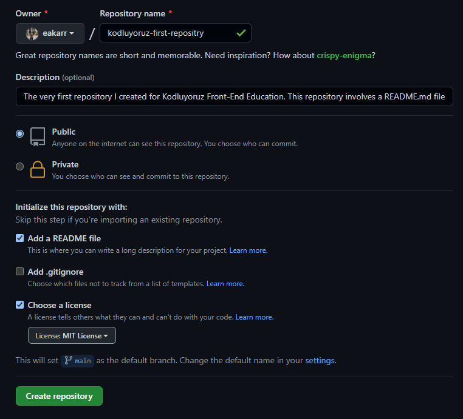

# The First Repository of the Kodluyoruz

The very first repository I created for Kodluyoruz Front-End Education. This repository contains README.md and index.html files.



<br />

## Installation
---
First of all, clone the project. 

```
git clone https://github.com/eakarr/kodluyoruz-first-repository.git
```

<br />

## Usage
---
After cloning the project file, open the file with Visual Studio Code.
<br />

For Linux,
<br />

```
cd kodluyoruz-first-repository
code .
```

<br />

## Contributors
---
Pull requests are accepted. For major changes, please open a discussion about what you want to change in this project. Thanks to all contributors!

<br />

## License
---
[MIT](LICENSE)